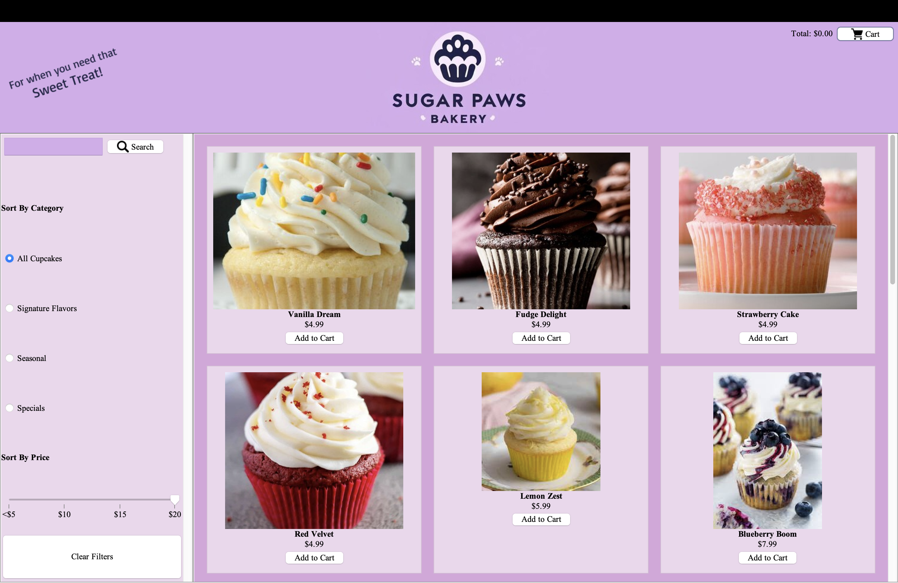

# Cupcake Shop GUI Group #10

## 👤 Group members: Aaron Aramburo, Natasha Budiman, Jennifer Pedomoro, Jennifer Garcia, My Lien Tan

## 📜 Table of Contents
- [Purpose](#-purpose)
- [Screenshots](#-screenshots)
- [Goal](#-goal)
- [Tools Used](#-tools-used)
- [Features](#-features)
- [Code functions](#code-functions)

## ✨ Purpose
Our online cupcake store is designed to make it easy and fun for customers to browse and order cupcakes from the comfort of their homes. Whether you're looking for a cupcake for a special occasion or just to treat yourself, we have something for everyone!

## 🎯 Goal
Our goal is to make buying cupcakes online a simple, enjoyable, and seamless experience. With easy-to-use features like a search bar, filters, a shopping cart, and secure checkout, we want customers to have a smooth and satisfying shopping experience from start to finish.
    - Search & Filter
    - Cart & Checkout
    - Real-time Price Updates
    - Easy Checkout

## 🔧 Tools Used
    - Java Swing: For GUI components and layout.
    - Cart and CartItem Class: Handle cart functionality and provides the total price of the order.
    - Product Class: Handles each product functionality (Name, Price, ImagePath, Category) and provide description of each product.
    - LocalDate: To calculate and format future pickup dates.
    - AWT and Swing Libraries: For styling, event handling, and layout management.
## 📌 Features
### 🛍️ Product Catalog
**Browse Cupcakes**: View a wide variety of delicious cupcakes with vibrant images and detailed pricing.

**Categories**: Filter cupcakes by categories like Signature Flavors, Seasonal Specials, and Price Range.

**Search Bar**: Quickly find your favorite cupcake by typing in its name.
### 🛒 Shopping Cart
**Add to Cart**: Seamlessly add cupcakes to your cart with just one click.

**Modify Quantities**: Adjust the quantity of each item directly within the cart.

**Remove Items**: Easily remove items from your cart to update your order.
### 📦 Checkout
**User Details**: Input your name, address, and contact number for smooth order processing.

**Order Options**: Select your preferred pickup time, including an option to schedule future pickups.
### 🎨 Modern Design
**Intuitive Layout**: A clean, visually pleasing design with pastel colors that enhance the user experience.

**Responsive UI**: Adapted for desktop and mobile platforms to ensure accessibility.
### 🔍 Additional Features
**Price Filters**: Filter products by price to suit your budget.

**Live Total Calculation**: Automatically update the total price as items are added or removed from the cart.

## 📷 Screenshots
    
    

# Code Functions
#### createTopPanel() : Create top panel (set backgorunds, labels, and create Cart Panel)
#### createCartPanel() : Create Cart Panel (set backgrounds, labels, buttons)
#### createSearchPanel() : Create Search Panel (set backgrounds, search field, buttons)
#### performSearch() : Function to perform search feature 
#### addFilterPanel(): Add Filter Panel to the left side of the window
#### createFilterPanel(): Create Filter Panel to add filter components (categories, clear filter button)
#### createPriceSlider(): Create Price slider (set major and paint ticks, set paint labels)
#### createfilterCategory():  Add filtered products based on the category selected
#### filterProductsBySlider(): Set filtered products by slider
#### resetFilters(): Clear all filters
#### createCustomPriceLabels(): Create price labels
#### createProductPanel(): Create product panel
#### showSelectionDialog(): Create a dialog with checkboxes and quantity selectors for the available cupcakes, count totalnumber of selected cupcakes, add selected quantity of cupcakes to the selectedCupcakes list, Validate the number of selected cupcakes based on the product type    
#### addProductToCart(): Add selected products to cart (set labels)
#### displayProducts(): Display products

